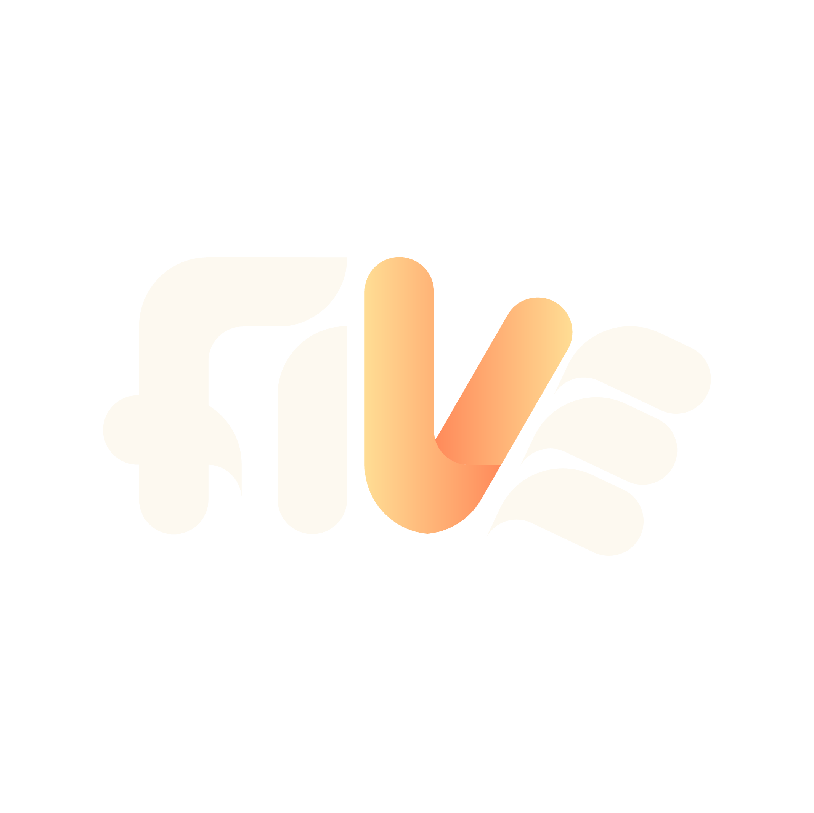

 

<h1>FiveV</h1>

<h3>Build the next roleplay experience.</h3>

 

 
 

 

<table>
  <tr>
    <td colspan="2">
      <h2>Overview</h2>
      

        <strong>FiveV</strong> là một hệ sinh thái server roleplay đang được phát triển với định hướng
        xây dựng launcher riêng, hệ thống lõi tùy biến, tài liệu nội bộ và quy trình vận hành đồng bộ hơn
        cho đội ngũ phát triển.
      

      

        Dự án tập trung vào việc tạo ra một nền tảng ổn định, hiện đại và có khả năng mở rộng lâu dài
        cho gameplay, resource, deployment và trải nghiệm người chơi.
      

    </td>
  </tr>
  <tr>
    <td width="50%" valign="top">
      <h2>Project Overview</h2>
      

        FiveV đang xây dựng nền tảng riêng cho server, bao gồm launcher, luồng cập nhật,
        tài nguyên game, hệ thống gameplay cốt lõi và quy trình vận hành.
      

      <ul>
        <li>Custom launcher & update workflow</li>
        <li>Core systems for server development</li>
        <li>Organization-wide tools and documentation</li>
      </ul>
    </td>
    <td width="50%" valign="top">
      <h2>Current Focus</h2>
      

        Giai đoạn hiện tại tập trung vào ổn định hạ tầng, chuẩn hóa source code,
        hoàn thiện tài liệu và mở rộng các module phục vụ phát triển lâu dài.
      

      <ul>
        <li>Server infrastructure</li>
        <li>Framework and resource structure</li>
        <li>Internal development workflow</li>
      </ul>
    </td>
  </tr>
</table>

 

<table>
  <tr>
    <td width="33%" valign="top" align="center">
      <h3>🚀 Custom Launcher</h3>
      

        Quản lý đăng nhập, cập nhật phiên bản và tối ưu trải nghiệm khởi chạy cho người chơi.
      

    </td>
    <td width="33%" valign="top" align="center">
      <h3>⚙️ Server Systems</h3>
      

        Xây dựng framework, resource và các hệ thống gameplay cốt lõi cho FiveV.
      

    </td>
    <td width="33%" valign="top" align="center">
      <h3>🧭 Infrastructure</h3>
      

        Tổ chức tài liệu, deploy, quản lý source và vận hành server theo quy trình rõ ràng.
      

    </td>
  </tr>
</table>

 

<table>
  <tr>
    <td width="50%" valign="top">
      <h3>Development Status</h3>
      

        FiveV đang trong giai đoạn phát triển nội bộ. Repository, tài liệu và workflow
        có thể được cập nhật liên tục theo tiến độ của đội ngũ.
      

    </td>
    <td width="50%" valign="top">
      <h3>Direction</h3>
      

        Dự án hướng tới một nền tảng roleplay có cấu trúc rõ ràng, dễ mở rộng,
        dễ vận hành và phù hợp với nhu cầu phát triển lâu dài.
      

    </td>
  </tr>
</table>

 

 

FiveV Organization · Work in progress · Built for roleplay server development

